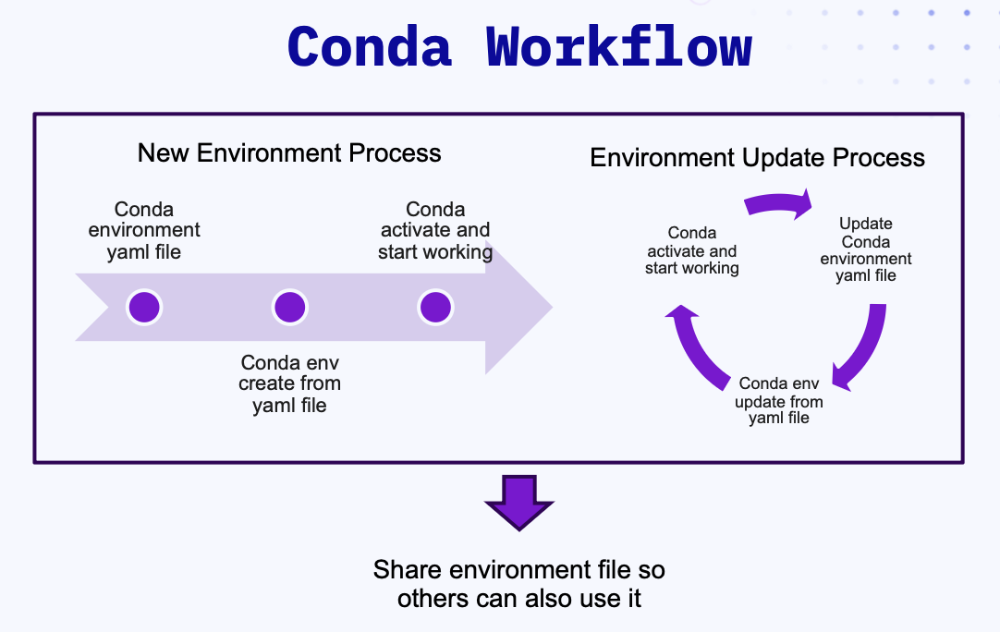

# Pixi: The evolution of cross-platform package manager

Pixi is a fast, modern, and reproducible package management tool that builds upon the conda ecosystem while introducing a project-centric approach to environment management. If you're familiar with conda/mamba, this guide will help you transition to Pixi and understand its unique advantages.

??? info "For Conda users: Conda workflows and Pixi"

    ## Why Pixi?

    Before Pixi, conda was the go-to tool for managing Python environments and packages, especially in data science and scientific computing. So why do we need Pixi?

    ### Conda Workflow

    Before answering that question, let's take a look at the current conda workflow. A typical "best practice" conda workflow involves the following steps. See the [Conda/Mamba Fundamentals](./conda-mamba.md) for more details.

    

    #### New Environment Process

    - Create a conda environment yaml file
    - Create a new conda environment from the yaml file
    - Activate the conda environment and start working with that environment

    #### Environment Update Process

    - Update the conda environment yaml file
    - Update the conda environment from the yaml file
    - Activate the conda environment and start working with that environment

    #### Environment Sharing Process

    - Share the conda environment yaml file with collaborators

    If you're a conda user, you might have noticed that this workflow is not very efficient. It requires you to manage multiple files, and the process of creating, updating, and sharing environments can be cumbersome, and it doesn't always guarantee reproducibility.

    ### How Pixi can help

    Pixi addresses several common pain points developers face with traditional conda workflows:

    - **Project-focused**: Environments are tied to projects, not global system state
    - **Built-in lockfiles**: Automatic dependency locking for perfect reproducibility
    - **Task management**: Cross-platform task runner built-in
    - **Multi-environment support**: Multiple environments per project
    - **Speed**: Pixi is implemented in Rust for fast solving
    - **Universal compatibility**: Works with both conda and PyPI packages

    ### Key Differences: Conda vs Pixi

    Here's a side-by-side comparison of common tasks:

    | Task | Conda/Mamba | Pixi |
    |------|-------------|------|
    | Initializing Project | N/A | `pixi init myproject` |
    | Creating an Environment | `conda create -n myenv python=3.11` | `pixi add python=3.11` (installs in default environment) |
    | Activating Environment | `conda activate myenv` | `pixi shell` (activate default environment) |
    | Installing Packages | `conda install numpy` | `pixi add numpy` (installs in default environment) |
    | Running Commands | `conda run -n myenv python script.py` | `pixi run python script.py` (runs in default environment) |
    | Sharing Environment | `conda export --format=yaml > environment.yaml` (will export `environment.yaml`) | Share `pixi.toml` and `pixi.lock` |
    | Multiple Environments | Separate conda envs | Multiple envs in one project |

    ## Migrating from Conda to Pixi

    ### From Conda Environment Files

    If you have an existing `environment.yml`:

    ```yaml
    name: my-project
    channels:
      - conda-forge
      - bioconda
    dependencies:
    - python=3.11
    - numpy
    - pandas
    - pip
    - pip:
        - scikit-learn
        - matplotlib
    ```

    Convert to Pixi:

    ```bash
    # Import existing environment.yml
    pixi init --import environment.yml my-project
    cd my-project
    ```

    This creates an equivalent `pixi.toml` automatically.

    ### From requirements.txt

    For Python projects with `requirements.txt`:

    ```bash
    pixi init my-python-project
    cd my-python-project

    # Add Python first
    pixi add python=3.11

    # Add PyPI dependencies from requirements.txt
    # (You'll need to convert these manually or use a script)
    cat requirements.txt | xargs -I {} pixi add --pypi {}
    ```

    ## Practical Exercises

    ### Exercise 1: Converting from Conda

    ??? example "1. Create a traditional environment.yml"

        Create a `environment.yml` file for a project:

        ```yaml
        name: conda-project
        channels:
        - conda-forge
        - bioconda
        dependencies:
        - python=3.11
        - pandas
        - numpy
        - matplotlib
        - fastqc  # from bioconda
        - pip
        - pip:
            - seaborn
        ```


    ??? example "2. Convert to Pixi"

        ```bash
        pixi init --import environment.yml converted-project
        cd converted-project
        ```

    **Examine the generated pixi.toml** and understand the conversion,
    see the rest of this document for more details on the `pixi.toml` file.
---

## Installation

### Quick Installation (Recommended)

On Linux & macOS, you can install pixi by running the following command:

    ```bash
    # With curl
    curl -fsSL https://pixi.sh/install.sh | bash

    # Or with wget
    wget -qO- https://pixi.sh/install.sh | sh
    ```

On Windows you can download the [installer](https://github.com/prefix-dev/pixi/releases/latest/download/pixi-x86_64-pc-windows-msvc.msi) or run the following command:

    ```powershell
    powershell -ExecutionPolicy ByPass -c "irm -useb https://pixi.sh/install.ps1 | iex"
    ```

For other installation methods go the the [pixi installation docs](https://pixi.sh/latest/installation/).

### Verification

Once you have pixi installed, you can verify by running the command below

    ```bash
    pixi --version
    ```

## Pixi Concepts

### 1. Creating a New Project

    ```bash
    # Create a new project directory with pixi.toml
    pixi init my-data-project
    cd my-data-project
    ```

This creates a project structure:

    ```text
    my-data-project/
    ├── .gitignore
    ├── .gitattributes
    └── pixi.toml
    ```

### 2. Understanding the Manifest File

The `pixi.toml` file is the heart of your project:

    ```toml
    [workspace]
    authors = ["Your Name <your.email@example.com>"] # (1)!
    channels = ["conda-forge"]  # (2)!
    name = "my-data-project" # (3)!
    description = "A data analysis project using Pixi" # (4)!
    platforms = ["osx-arm64"] # (5)!
    version = "0.1.0" # (6)!

    [tasks]
    # Cross-platform tasks go here

    [dependencies]
    # Conda packages go here

    [pypi-dependencies]
    # PyPI packages go here
    ```

1. The `authors` field is optional but recommended for project metadata. By default, when you run `pixi init`, it will use your git config user name and email.
2. The `channels` field allows you to specify conda channels for package resolution.
3. The `name` field specifies the name of your project.
4. The `description` field is optional but useful for project metadata.
5. The `platforms` field specifies the platforms you intend to support. By default, it will use your current platform.
6. The `version` field specifies the version of your project.

### 3. Adding Dependencies

Add conda packages (equivalent to `conda install`):

    ```bash
    pixi add python=3.11
    pixi add numpy pandas matplotlib scipy
    ```

Add PyPI packages:

    ```bash
    pixi add --pypi scikit-learn seaborn
    ```

Add packages from specific channels:

   1. First we add the channel to the workspace:

    ```bash
    pixi workspace channel add bioconda
    ```

   2. Then we can add packages from that channel:

    ```bash
    pixi add bioconda::fastqc
    ```

### 4. Locking Dependencies

Pixi automatically generates a `pixi.lock` file when you add packages. This file locks the exact versions of all dependencies, ensuring reproducibility. You can also manually lock the environment to update the lockfile:

    ```bash
    pixi lock
    ```

### 5. Working with Your Environment

Activate the environment (equivalent to `conda activate`):

    ```bash
    pixi shell
    ```

Or run commands directly:

    ```bash
    pixi run python --version
    pixi run python -c "import numpy; print(numpy.__version__)"
    ```

Finer-grained control over the environment and dependencies can be achieved
by using `feature`. Feature is a way to group dependencies and tasks together. For example, you can create a `test` feature for testing dependencies:

    ```bash
    pixi add --feature test pytest coverage # (1)!
    pixi workspace environment add test --features test # (2)!
    ```

1. This adds `pytest` and `coverage` to a feature called `test`. You can then run tasks or commands specific to this feature.
2. This adds a new environment called `test` that includes the `test` feature. You can then activate this environment.

To activate the `test` environment, you can use:

    ```bash
    pixi shell -e test
    ```

### 6. Task Management

Define cross-platform tasks in your `pixi.toml`:

    ```toml
    [tasks]
    # Simple commands
    clean = "rm -rf __pycache__ .pytest_cache"
    pytest = "pytest tests/"
    coverage = "coverage report"

    # Multi-step tasks
    test = { depends-on = ["pytest", "coverage"] }

    # Task with required arguments
    [tasks.greet]
    args = ["name"]
    cmd = "echo Hello, {{ name }}!"

    # Task with optional arguments (default values)
    [tasks.build]
    args = [
    { "arg" = "project", "default" = "my-app" },
    { "arg" = "mode", "default" = "development" },
    ]
    cmd = "echo Building {{ project }} in {{ mode }} mode"

    # Task with mixed required and optional arguments
    [tasks.deploy]
    args = ["service", { "arg" = "environment", "default" = "staging" }]
    cmd = "echo Deploying {{ service }} to {{ environment }}"

    ```

Run tasks:

    ```bash
    pixi run clean
    pixi run test
    pixi run greet --name Bob
    pixi run build --project my-app --mode production
    pixi run deploy --service my-service --environment production
    ```

### 7. Platform-Specific Dependencies

These dependencies will only be installed on the specified platform. This is useful for packages that are platform-specific, like compilers or system libraries.

    ```toml
    # Different dependencies per platform
    [dependencies]
    python = "3.11.*"

    [target.linux-64.dependencies]
    # Linux-specific packages
    gcc = "*"

    [target.win-64.dependencies] 
    # Windows-specific packages
    vs2019_win-64 = "*"

    [target.osx-arm64.dependencies]
    # macOS ARM-specific packages
    ```

### 8. Global Tool Installation

Pixi can also install global tools (like conda's base environment):

    ```bash
    # Install global tools
    pixi global install ripgrep bat fd-find
    pixi global install jupyter --expose jupyter --expose ipython

    # List installed global tools
    pixi global list
    ```

## Practical Exercises

### Exercise 1: Create Your First Pixi Project

??? example "1. Create a new project"

    ```bash
    pixi init my-analysis
    cd my-analysis
    ```

??? example "2. Add dependencies"

    ```bash
    pixi add python=3.11 pandas numpy matplotlib
    pixi add --pypi seaborn
    ```

??? example "3. Create a simple analysis script"

    ```python
    # analysis.py
    import pandas as pd
    import numpy as np
    import matplotlib.pyplot as plt
    import seaborn as sns
    
    # Create sample data
    data = pd.DataFrame({
        'x': np.random.randn(100),
        'y': np.random.randn(100)
    })
    
    # Create plot
    plt.figure(figsize=(8, 6))
    sns.scatterplot(data=data, x='x', y='y')
    plt.title('Sample Analysis')
    plt.savefig('analysis.png')
    print("Analysis complete! Check analysis.png")
    ```

??? example "4. Add task called `analyze` for running script"

    ```bash
    pixi task add analyze "python analysis.py"
    ```

??? example "5. Run the `analyze` task:"

    ```bash
    pixi run analyze
    ```

**Examine the output** in the CLI. What does it show?

### Exercise 2: Create Multi-Environment Setup

??? example "1. Add testing dependencies to a feature"

    ```bash
    pixi add --feature test pytest
    ```

??? example "2. Update your pixi.toml to define environments"

    ```toml
    [environments]
    default = {solve-group = "default"}
    test = {features = ["test"], solve-group = "default"}
    ```

??? example "3. Create a test file"

    ```python
    # test_analysis.py
    import pandas as pd
    import numpy as np
    
    def test_data_creation():
        data = pd.DataFrame({
        'x': np.random.randn(10),
        'y': np.random.randn(10)
        })
        assert len(data) == 10
        assert 'x' in data.columns
        assert 'y' in data.columns
    ```

??? example "4. Add test task and run it"

    ```bash
    pixi task add test "pytest test_analysis.py -v"
    pixi run -e test test
    ```

**Congratulations!** If you've completed these exercises, you now have a solid understanding of Pixi's core concepts and how to use it effectively in your projects.

## Resources and Further Reading

To be a Pixi expert, explore their [**Official Documentation**](https://pixi.sh/latest/).

## Conclusion

Pixi represents the evolution of conda-based package management, bringing modern development practices like project-centric environments, automatic lockfiles, and integrated task management. For conda users, the transition involves shifting from global environment-centric to project-centric thinking, but the benefits in reproducibility, collaboration, and development velocity hopefully make it worthwhile.

Start with simple projects, gradually adopt advanced features like multi-environment setups and task management, and you'll find Pixi to be a powerful upgrade to your development workflow.
