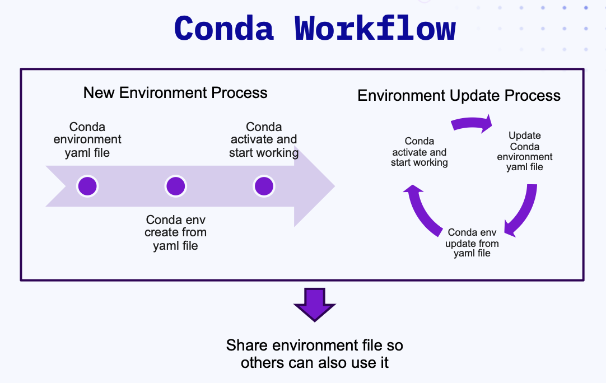

# Pixi: The evolution of cross-platform package manager

Pixi is a fast, project-centric package manager that combines the conda-forge and PyPI ecosystems behind a single manifest and a single lock file, giving you the same environment on every machine without a separate activation step.

!!! info "Version"

    Verified against pixi 0.73.0 (July 2026). Commands and output on this page
    were captured from a real run against that version. Older pixi releases may
    differ; where a feature needs a minimum version, it is noted inline.

## Why pixi?

You inherit a project. It has an `environment.yml` or a `requirements.txt` sitting at the top level, so you do what the README says: create the environment and run the analysis. Sometimes the solve just fails — a pinned version no longer exists on the channel, or a new release broke a transitive dependency that used to resolve cleanly. Other times it's worse: the solve succeeds, the environment builds, and you get numbers that don't match the paper.

This is not bad luck. It's the default outcome. Neither conda nor pip writes a lock file unless you go out of your way to produce one — `conda env export`, `pip freeze` — and most projects don't. An `environment.yml` or `requirements.txt` describes an *intent* ("something compatible with numpy>=1.20"), not a record of what was actually installed. Solve that intent again six months later, against a channel that has moved on, and you can easily land on a different set of package versions.

Named conda environments compound the problem. A `conda create -n myenv` environment is shared and long-lived: it sits outside the project, gets `conda install`ed into over months, and nobody remembers exactly what's in it anymore. Whether it's even active is invisible state that lives in your shell, not in the project directory — you can `cd` into a project and have no idea if the right environment, or any environment, is active.

For the rest of this page, "reproducible" means one specific thing: **same inputs plus the same environment yields the same outputs, on anyone's machine.** Everything pixi does is in service of that definition.

### The conda workflow



The typical "best practice" conda workflow has three separate processes, each involving the same environment file:

- **New environment** — write a `environment.yml`, create the environment from it, then activate it before you can work.
- **Update** — edit the `environment.yml`, update the environment from the changed file, then reactivate.
- **Share** — hand the `environment.yml` to a collaborator and hope their solve matches yours.

Every step depends on a human remembering to keep the environment and the file in sync, and none of the steps produce an exact, replayable record of what got installed. See [Conda/Mamba Fundamentals](./conda-mamba.md) for the full conda workflow.

### conda/mamba, uv, and pixi

| Concern | conda / mamba | uv | pixi |
| --- | --- | --- | --- |
| Environment scope | Shared, named, global | Per-project | Per-project, tied to the folder |
| Lock file | Opt-in (`conda env export`) | Yes, by default | Yes, written automatically on every change |
| Task running | None | None | Built in (`pixi run <task>`) |
| Activation | `conda activate` required | Not required | Never required |
| conda-forge packages | Yes | No | Yes |
| PyPI packages | Via nested `pip:` | Yes | Yes, same manifest and lock |
| Compiled/system libs (CUDA, MKL, GDAL) | Yes | Only if a wheel exists | Yes |

!!! tip "When `uv` alone is enough"

    For a pure-Python project whose dependencies all live on PyPI, `uv` is an
    excellent choice and you do not need pixi. Pixi earns its place when your
    stack includes compiled or non-Python dependencies — the Python interpreter
    itself, CUDA, MKL, GDAL's C libraries — that either are not on PyPI or ship
    there as fragile wheels.

??? info "How pixi actually solves an environment"

    Pixi does not compete with `uv` so much as build on it. When pixi solves an
    environment it resolves the **conda** packages first with the `rattler`
    solver, then resolves the **PyPI** packages with `uv` — and crucially, it
    resolves the PyPI half *on top of* the conda half, so the two are guaranteed
    compatible. Both are driven by the same SAT solver, `resolvo`, and both land
    in a single `pixi.lock`.

    That is the real difference in scope: `uv` resolves PyPI. Pixi resolves
    conda-forge *and* PyPI, together, in one lock file.

## Installation

### Quick Installation (Recommended)

On Linux & macOS, you can install pixi by running the following command:

```bash
# With curl
curl -fsSL https://pixi.sh/install.sh | bash

# Or with wget
wget -qO- https://pixi.sh/install.sh | sh
```

On Windows you can download the [installer](https://github.com/prefix-dev/pixi/releases/latest/download/pixi-x86_64-pc-windows-msvc.msi) or run the following command:

```powershell
powershell -ExecutionPolicy ByPass -c "irm -useb https://pixi.sh/install.ps1 | iex"
```

For other installation methods go to the [pixi installation docs](https://pixi.sh/latest/installation/).

### Verification

Once you have pixi installed, you can verify by running the command below

```bash
pixi --version
```

## Your first project

Create a new project with `pixi init`, then move into it:

```bash
pixi init my-analysis
cd my-analysis
```

pixi creates a small tree:

```text
my-analysis/
├── .gitattributes
├── .gitignore
└── pixi.toml
```

`pixi.toml` is the manifest — the file you edit by hand to describe the project. This is exactly what `pixi init` writes into it:

```toml title="pixi.toml"
[workspace]
channels = ["conda-forge"]  # (1)!
name = "my-analysis"  # (2)!
platforms = ["osx-arm64"]  # (3)!
version = "0.1.0"  # (4)!

[tasks]

[dependencies]
```

1. `channels` says where packages come from, in priority order. `conda-forge` is the default.
2. `name` identifies the project. `pixi init` took it from the argument you gave it.
3. `platforms` says which platform(s) the lock file must cover. Add more (`linux-64`, `win-64`, `linux-aarch64`, ...) so the project also solves on other machines.
4. `version` is the project's own version, independent of anything you later publish.

`[tasks]` and `[dependencies]` are generated empty — pixi always writes both tables, ready for you to fill in as you add tasks and packages later in this guide.

`authors` and `description` are optional fields you can add yourself; pixi 0.73.0's `init` does not write them, however you may see them listed in older tutorials.

!!! note "`[workspace]` or `[project]`?"

    Older pixi tutorials show a `[project]` table. It was renamed to
    `[workspace]`. `[project]` still parses, but pixi 0.73.0 emits a deprecation
    warning telling you to replace it. Use `[workspace]` in new projects.

### Adding dependencies

A project with no dependencies doesn't do much. Add the three packages this analysis needs:

```bash
pixi add python numpy matplotlib
```

```text
✔ Added python >=3.14.6,<3.15
✔ Added numpy >=2.5.1,<3
✔ Added matplotlib >=3.11.1,<4
```

Notice that `python` went in unpinned — the command was `pixi add python`, not `pixi add python=3.11`. pixi's default pinning strategy already wrote the `>=3.14.6,<3.15` range for you, so you rarely need to pin versions by hand.

`pixi.toml` now has a filled-in `[dependencies]` table:

```toml title="pixi.toml"
[dependencies]
python = ">=3.14.6,<3.15"
numpy = ">=2.5.1,<3"
matplotlib = ">=3.11.1,<4"
```

## What just happened

Look at the directory again:

```text
my-analysis/
├── .gitattributes
├── .gitignore
├── .pixi/
├── pixi.lock
└── pixi.toml
```

Two new things appeared: `pixi.lock` and `.pixi/`. Their sizes on disk tell you most of what you need to know about what each one is for:

```text
      12 pixi.toml
    1184 pixi.lock
```

`pixi.toml` barely grew — it's still three short version ranges. `pixi.lock` is nearly a hundred times larger. That gap is the whole model:

- **`pixi.toml` is the manifest: your intent.** Version ranges, written by you, small and readable, meant to be reviewed in a diff.
- **`pixi.lock` is the lock file: the exact solution.** Every package, every exact version, build string and hash, resolved for every platform listed in `platforms`. pixi writes and maintains it; you never hand-edit it.
- **`.pixi/` is the environment directory: a disposable build product.** It's the actual environment — interpreter and packages unpacked on disk — built from `pixi.lock`. It's gitignored, and pixi can rebuild it from the lock file at any time.

Commit `pixi.toml` and `pixi.lock`. Never commit `.pixi/`.

## Running code

There's no environment to activate. Run a single command inside the project's environment with `pixi run`:

```bash
pixi run python -V
pixi run python -c "import numpy; print(numpy.__version__)"
```

Each invocation resolves the environment, runs the one command you gave it, and exits — nothing lingers in your shell. `pixi run` works from anywhere in the project tree, not just the directory holding `pixi.toml`, so you don't need to `cd` to the project root first.

For a longer interactive session, drop into a shell with the environment already set up instead:

```bash
pixi shell
```

```bash
exit
```

`exit` (or `Ctrl-D`) leaves the shell and returns you to whatever environment, or lack of one, you had before. Either way — `pixi run` for one-off commands, `pixi shell` for a session — there's no global environment to remember to deactivate afterward.

## The running example

The rest of this page uses a small script, `analysis.py`, that you should save into `my-analysis/`. It's a seeded Monte Carlo estimate of pi: everyone who runs it with the default sample count gets the exact same numbers, so the output below is not "an example" — it's what you'll actually see.

```python title="analysis.py"
"""Seeded Monte Carlo estimate of pi."""

import argparse

import matplotlib

matplotlib.use("Agg")
import matplotlib.pyplot as plt
import numpy as np

parser = argparse.ArgumentParser()
parser.add_argument("--samples", type=int, default=100_000)
args = parser.parse_args()

rng = np.random.default_rng(42)
xy = rng.random((args.samples, 2))
inside = (xy**2).sum(axis=1) <= 1.0
running = 4 * np.cumsum(inside) / np.arange(1, args.samples + 1)
estimate = running[-1]

print(f"samples : {args.samples:,}")
print(f"estimate: {estimate:.6f}")
print(f"error   : {abs(estimate - np.pi):.6f} ({abs(estimate - np.pi) / np.pi:.4%})")

plt.figure(figsize=(8, 4))
plt.plot(running, lw=0.8)
plt.axhline(np.pi, color="crimson", ls="--", label="pi")
plt.xlabel("samples")
plt.ylabel("estimate")
plt.legend()
plt.savefig("pi-estimate.png", dpi=120, bbox_inches="tight")
print("wrote   : pi-estimate.png")
```

Run it the same way you ran `python -V` above:

```bash
pixi run python analysis.py
```

```text
samples : 100,000
estimate: 3.150080
error   : 0.008487 (0.2702%)
wrote   : pi-estimate.png
```

## Tasks

Typing `pixi run python analysis.py` every time gets old, and it doesn't capture the `--samples` flag you might want for a quick check. Pixi tasks turn a command into a name, stored in the manifest, that anyone with the project can run.

Add three of them:

```bash
pixi task add analyze "python analysis.py"
pixi task add quick "python analysis.py --samples 2000" --description "Fast sanity check"
pixi task add full "python analysis.py" --depends-on quick
```

Each call rewrites the manifest's `[tasks]` table:

```toml title="pixi.toml"
[tasks]
analyze = "python analysis.py"
quick = { cmd = "python analysis.py --samples 2000", description = "Fast sanity check" }
full = { cmd = "python analysis.py", depends-on = ["quick"] }
```

Look at what happened to `quick` and `full`: pixi promoted them from a plain string to an inline table the moment they needed to carry something beyond the bare command — a `description`, a `depends-on`. `analyze` stays a one-line string because a command is all it is.

`full` depends on `quick`, so running it runs the chain:

```bash
pixi run full
```

```text
✨ Pixi task (quick): python analysis.py --samples 2000: (Fast sanity check)
samples : 2,000
estimate: 3.138000
error   : 0.003593 (0.1144%)
wrote   : pi-estimate.png

✨ Pixi task (full): python analysis.py
samples : 100,000
estimate: 3.150080
error   : 0.008487 (0.2702%)
wrote   : pi-estimate.png
```

`quick` runs first, in full, then `full` itself runs. Chain as many tasks together as the workflow needs; pixi runs each dependency once, in order, before the task you asked for.

### Listing tasks

Run `pixi run` with no task name, and pixi lists what's available:

```bash
pixi run
```

```text
Available tasks:
	analyze
	full
	quick
```

Names only — no descriptions. For those, ask `pixi task list` instead:

```bash
pixi task list
```

```text
Tasks that can run on this machine:
-----------------------------------
analyze (by design), full (by design), quick (by design)
Task   Description
quick  Fast sanity check
```

## Why this matters

Tasks ship *with* the project, inside `pixi.toml`, not in your shell history or a README someone forgot to update. The next person who clones `my-analysis` doesn't read documentation to learn how to reproduce your result — they run `pixi run analyze`. They never dig through your terminal scrollback, and they never have to reverse-engineer a Makefile to figure out what `make` actually does here.

!!! example "A real one: this site"

    The guidelines site you are reading is itself a pixi workspace. Its
    `pixi.toml` defines `start` for local preview, `rtd-publish` for the
    Read the Docs build, and a `release` task that uses `depends-on` to run
    `set-default-repo` first. Every page here was built by `pixi run`.

### Your turn

Add a task called `clean` that deletes `pi-estimate.png`, then chain it so that
`analyze` always starts from a clean slate.

??? success "Solution"

    ```bash
    pixi task add clean "rm -f pi-estimate.png"
    pixi task add fresh "python analysis.py" --depends-on clean
    pixi run fresh
    ```

## The lock file

You've been told `pixi.lock` is "the exact solution." Look at one entry from it and see what that actually means. Find the `numpy` package pixi resolved for this project:

```bash
grep -A 8 "numpy-2.5.1-py314hb79c6fa_0.conda$" pixi.lock
```

```yaml
- conda: https://conda.anaconda.org/conda-forge/osx-arm64/numpy-2.5.1-py314hb79c6fa_0.conda
  sha256: 3aa853ec05e6fe6b660be354fd05ab2a89b2e6cc6346612a6c75a18f38f62c3d
  md5: 3587914062d5537dde5fa8c2131cf624
  depends:
  - python
  - __osx >=11.0
  - libcxx >=19
  - python_abi 3.14.* *_cp314
  - liblapack >=3.9.0,<4.0a0
```

Every field is more specific than what `pixi.toml` asked for:

- The `conda:` line is a full URL — channel, platform, package name, version, *and build string* (`py314hb79c6fa_0`). The build string distinguishes this exact build of numpy 2.5.1 from any other build of the same version compiled against a different Python or a different BLAS.
- `sha256` and `md5` are content hashes of the download itself. They let pixi (or anyone) verify that the bytes it just fetched are the bytes that were solved, not a package that was quietly rebuilt or repackaged under the same name and version.
- `depends` is that package's own dependency list, exactly as conda-forge published it for this build — not something pixi invented. It's how the solver knew this build of numpy needed this Python ABI and this `liblapack` range in the first place.

This block repeats — once per package, once per platform in `platforms` — for every one of the three packages you added. That's the whole file: `pixi.toml` holds three version ranges you wrote by hand, about a dozen lines. `pixi.lock` holds the solved answer for all of them, sha256 and all: 1,184 lines.

### Proof: `.pixi/` is disposable

Earlier, this page called `.pixi/` a disposable build product. Prove it. Delete it and rerun the task that depends on it:

```bash
rm -rf .pixi
pixi run analyze
```

```text
✨ Pixi task (analyze): python analysis.py
samples : 100,000
estimate: 3.150080
error   : 0.008487 (0.2702%)
wrote   : pi-estimate.png
```

No error, no re-solve, no prompt — and the results match every other run of this same seeded script on this page. Pixi noticed the environment directory was gone, reinstalled every package straight from `pixi.lock`, and then ran the task, all inside that one `pixi run` call. Nothing about the *content* of the run changed, because nothing about the lock file changed.

That's the payoff of the rule from earlier: `.pixi/` is a cache, rebuildable at any time from `pixi.lock`. `pixi.toml` and `pixi.lock` *are* the project. This is why `.pixi/` is gitignored, and why a dead laptop, a wiped CI runner, or a fresh clone is a non-event — `pixi run` rebuilds the exact same environment from the lock file every time.

### Which file guarantees what

The manifest records what you asked for; the lock file records what you got. A collaborator who clones your project with `pixi.lock` intact gets the exact versions, builds, and hashes you resolved — the same numbers this page has been showing you. A collaborator who has only `pixi.toml` — say, because `pixi.lock` was gitignored by mistake — gets whatever the solver picks today, against whatever conda-forge and PyPI look like today. Those can be different environments even though the manifest never changed.

## Beyond one environment

Your users need `numpy` and `matplotlib` to run the analysis, nothing more. You, working on the project, also want `pytest` for tests, maybe a linter, maybe IPython for exploring interactively. Put all of that in one `[dependencies]` table and everyone who installs the project pulls your entire toolchain along with it — installs get slower, the solve gets harder, and "what does this need to run" gets muddied with "what do I need to work on it."

Conda's usual answer is a second `environment-dev.yml`, maintained by hand alongside the first, and the two drift apart the moment someone forgets to update both. Pixi keeps the answer inside the one manifest and the one lock file: declare **features** — named groups of extra dependencies — then compose them into **environments**.

Add `pytest` as a feature called `dev`, then create an environment that uses it:

```bash
pixi add --feature dev pytest
pixi workspace environment add dev --feature dev
```

The first command's output looks almost like any other `pixi add`, with one difference:

```text
✔ Added pytest
Added these only for feature: dev
```

`pytest` is now in the manifest, but no environment references the `dev` feature yet, so it isn't part of your project's default environment and isn't installed anywhere. A feature that no environment uses is inert, and pixi says so the next time it parses the manifest. That happens on the very next command, `pixi workspace environment add`, before that same command's own fix takes effect:

```text
 WARN Encountered 1 warning while parsing the manifest:
  ⚠ The feature 'dev' is defined but not used in any environment. Dependencies
  │ of unused features are not resolved or checked, and use wildcard (*)
  │ version specifiers by default, disregarding any set `pinning-strategy`
    ╭─[pixi.toml:17:10]
 16 │
 17 │ [feature.dev.dependencies]
    ·          ───
 18 │ pytest = "*"
    ╰────
  help: Remove the feature from the manifest or add it to an environment

✔ Added environment dev
```

(The exact line numbers depend on your manifest.) That ordering — a warning about a problem, immediately followed by the command that fixes it — looks backwards until you remember that pixi re-parses the whole manifest before acting on it. It read the orphaned `dev` feature left over from the previous command, flagged it, and then this command wired that feature into an environment: the very fix the warning asked for. Seeing the warning land between the two commands is what makes the two-step sequence — add to a feature, then attach the feature to an environment — feel purposeful instead of arbitrary.

The manifest now carries both pieces:

```toml title="pixi.toml"
[feature.dev.dependencies]
pytest = "*"

[environments]
dev = ["dev"]
```

### Crossing the environment boundary

Ask each environment what it can see. Inside `dev`:

```bash
pixi run -e dev pytest --version
```

```text
pytest 9.1.1
```

Without `-e dev` — the default environment, the one everyone gets:

```bash
pixi run pytest --version
```

```text
pytest: command not found

Available tasks:
	analyze
	full
	quick
```

That failure is the point, not a bug to work around. The default environment is exactly what a user gets the moment they clone `my-analysis` and run `pixi run analyze`: python, numpy, matplotlib, and nothing you added only for yourself.

`dev = ["dev"]` under `[environments]` is a list of feature names — here, just the one. Yet the `dev` environment has `numpy` and `matplotlib` too, not only `pytest`: every environment implicitly includes the `default` feature — whatever lives in the bare `[dependencies]` table — unless you explicitly opt out with `--no-default-feature`. That's the whole rule. `dev` isn't `pytest` in isolation; it's `default` plus `pytest`.

### Your turn

Create a `repl` feature containing `ipython`, wire it into an environment of the
same name, and confirm the default environment still cannot see it.

??? success "Solution"

    ```bash
    pixi add --feature repl ipython
    pixi workspace environment add repl --feature repl
    pixi run -e repl ipython --version
    pixi run ipython --version   # command not found
    ```

## conda and PyPI in one project

Not everything you want lives on conda-forge. Pixi can pull from PyPI in the same project, using the same lock file, without reaching for `pip install` on the side. Add `humanize` — a small package for formatting numbers and dates that has no conda-forge build — with `--pypi`:

```bash
pixi add --pypi humanize
```

```text
✔ Added humanize >=4.16.0, <5
Added these as pypi-dependencies.
```

That second line matters: `pixi add python numpy matplotlib` all went into `[dependencies]`, but this one went somewhere new.

```toml title="pixi.toml"
[pypi-dependencies]
humanize = ">=4.16.0, <5"
```

It behaves like any other dependency once it's there:

```bash
pixi run python -c "import humanize; print(humanize.__version__)"
```

```text
4.16.0
```

### conda-forge first

`--pypi` is easy to reach for out of habit, but it isn't the default choice — `[dependencies]` is. The rule:

- Prefer conda-forge (`[dependencies]`) for compiled and scientific-stack packages — numpy, matplotlib, scipy, anything with C or Fortran underneath. One solver then reasons about binary compatibility across the whole environment, which is what prevents ABI mismatches.
- Reach for `--pypi` when a package is not on conda-forge at all.
- Both kinds land in the same `pixi.lock`. One file still pins the entire environment.

`humanize` earns its place in this example because it genuinely has no conda-forge build — there's no other way to get it into the project. numpy, matplotlib, and anything like them belong in `[dependencies]`, not behind `--pypi`: split a compiled, interdependent stack like that across two separate solvers and you lose the one thing a single conda solve buys you — a solver that reasons about binary compatibility across the *whole* environment at once. Reach for `--pypi` only after checking conda-forge and coming up empty.

### Packages from other channels

`conda-forge` isn't the only channel, and it isn't always where a package lives. `bioconda`, for example, hosts a large share of the bioinformatics tooling that research-computing users reach for — tools like `fastqc` that conda-forge doesn't carry. Add the channel to the workspace first:

```bash
pixi workspace channel add bioconda
```

```text
✔ Added bioconda (https://conda.anaconda.org/bioconda/)
```

```toml title="pixi.toml"
[workspace]
channels = ["conda-forge", "bioconda"]
```

`channels` under `[workspace]` is an ordered list, and pixi searches it in order. Adding `bioconda` here makes every package on it available to the whole workspace, not just to whatever you add next.

Most of the time you don't need to say which channel a package comes from — pixi searches the whole list and picks it up. To pin one package to a specific channel regardless of ordering, use `channel::package`:

```bash
pixi add bioconda::fastqc
```

```text
✔ Added bioconda::fastqc
```

```toml title="pixi.toml"
[dependencies]
fastqc = { version = ">=0.12.1,<0.13", channel = "bioconda" }
```

Notice what landed in the manifest: not a bare version string like the other entries in `[dependencies]`, but a table with a `channel` key. `channel::package` at the command line isn't just a lookup hint — pixi records the channel choice in `pixi.toml`, so a collaborator reading the manifest (or the solver resolving it later) knows `fastqc` comes from `bioconda` specifically, not wherever else it happens to be found.

## Inspecting your environment

At this point `my-analysis` has grown past what fits in your head: two environments, three conda dependencies, a PyPI dependency, three tasks. The next time something looks wrong — a version you didn't expect, a package you can't find — you need a fast answer to "what did pixi actually install, and why is that package here?" Four commands answer that.

`pixi list` shows every package installed in the default environment, one row each, with version, build string, size, and where it came from:

```bash
pixi list
```

Add `-e` to ask about a named environment instead of the default one:

```bash
pixi list -e dev
```

`pixi list` is flat — it tells you *what* is installed, not *why*. `pixi tree` answers the second question, showing the dependency graph so you can see which of your direct dependencies pulled in a package you never asked for:

```bash
pixi tree
```

```text
Installed for: osx-arm64
├── humanize 4.16.0
├── matplotlib 3.11.1
│   ├── matplotlib-base 3.11.1
│   │   ├── contourpy 1.3.3
│   │   │   ├── numpy 2.5.1
│   │   │   │   ├── python 3.14.6
```

Read it top to bottom: `numpy` isn't a top-level entry here because nothing above it is looking for it directly — it's pulled in as a dependency of `contourpy`, which is pulled in by `matplotlib-base`, which is pulled in by `matplotlib`, which you did add directly. When a version you didn't pin shows up in `pixi.lock`, `pixi tree` is how you find which of your dependencies is responsible.

Neither command tells you which environments exist or what's in each of them at a glance. `pixi info` does:

```bash
pixi info
```

```text
Environments
------------
        Environment: default
           Features: default
           Channels: conda-forge
   Dependency count: 3
       Dependencies: python, numpy, matplotlib
  PyPI Dependencies: humanize
   Target platforms: osx-arm64
    Prefix location: ~/my-analysis/.pixi/envs/default
              Tasks: analyze, full, quick

        Environment: dev
           Features: dev, default
           Channels: conda-forge
   Dependency count: 4
       Dependencies: pytest, python, numpy, matplotlib
```

This is the summary to reach for first when the question is about environments rather than individual packages: it lists every environment in the workspace, the features each one composes, the dependencies and tasks that come with it, and where its files live on disk — all without picking one environment ahead of time the way `pixi list -e` requires.

## Tools without a project

Not everything you install needs to live inside a project. A linter, a formatter, a CLI utility you use across every repo you touch — none of that belongs in `my-analysis`'s `[dependencies]`, because it isn't part of what `my-analysis` needs to run. It's a tool *you* use, not something the project depends on.

The old habit is to `pip install` a tool like that into whatever environment happens to be active. That's how you end up with "I pip-installed a linter into my analysis environment and broke it" — the tool's own dependencies collide with the project's, and now neither one solves cleanly. `pixi global install` avoids the collision entirely by giving each tool its own isolated environment under `~/.pixi`, completely separate from any project and from every other global tool:

```bash
pixi global install ruff
```

```text
└── ruff: 0.16.0 (installed)
    └─ exposes: ruff
```

To see what you have installed globally and which commands each one exposes on your `PATH`, run `pixi global list`:

```bash
pixi global list
```

```text
Global environments as specified in '~/.pixi/manifests/pixi-global.toml'
└── ruff: 0.16.0
    └─ exposes: ruff
```

Here, the `ruff` environment exposes a single `ruff` command. A tool with several entry points can expose more than one; `--expose` lets you control exactly which binaries from the installed package become available on your `PATH`, and under what name, rather than accepting all of them.

Keep the distinction in mind: `pixi add` changes a project's manifest and lock file, checked into git, reproducible on any machine that clones the project. `pixi global install` changes state on *your* machine, outside any project — nothing about it is recorded in `my-analysis`, and a collaborator cloning your repository gets no trace of it. Reach for it for tools you personally use across projects, not for anything a project needs to run.

## Migrating from conda

If you're starting from an existing conda project rather than from scratch, pixi can read its `environment.yml` and generate a starting manifest instead of you re-declaring every dependency by hand. Given this file:

```yaml title="environment.yml"
name: old-analysis
channels:
  - conda-forge
dependencies:
  - python=3.11
  - numpy
  - pip
  - pip:
      - humanize
```

Import it into a new pixi project:

```bash
pixi init --import environment.yml migrated
```

The generated `pixi.toml`:

```toml title="pixi.toml"
[workspace]
channels = ["conda-forge"]
name = "old-analysis"
platforms = ["osx-arm64"]
version = "0.1.0"

[tasks]

[dependencies]
python = "3.11.*"
numpy = "*"
pip = "*"

[pypi-dependencies]
humanize = "*"
```

The translation follows a fixed pattern:

| `environment.yml` | pixi manifest |
| --- | --- |
| `name:` | `[workspace] name` |
| `channels:` | `[workspace] channels` |
| `dependencies:` | `[dependencies]` |
| `pip:` entries | `[pypi-dependencies]` |

One thing to clean up by hand: the import carried `pip` itself into `[dependencies]`, because it was a literal entry in the source file's `dependencies:` list. Pixi doesn't need `pip` installed to manage `[pypi-dependencies]` — that entry is safe to delete.

The versions in the generated manifest are also worth a second look. `python=3.11` became the range `3.11.*`, which is a reasonable translation. But `numpy` and `humanize`, which had no version pin in `environment.yml`, both became the wildcard `*` — accept whatever the solver finds today, with no lower bound at all. Treat the import as a starting point, not a finished manifest: replace `*` with real ranges for anything that matters, the same way you would for a dependency you added by hand with `pixi add`.

If your old project instead tracked dependencies in a `requirements.txt`, don't import it one line at a time — piping it through `xargs` so that each package gets its own `pixi add --pypi` call runs a full dependency solve per line, which is slow and wasteful for a file with any real number of entries. Batch it into a single call instead:

```bash
pixi add --pypi $(tr '\n' ' ' < requirements.txt)
```

That resolves every package in one solve, the same way `pixi add python numpy matplotlib` did earlier on this page.

## Cheat sheet

### CLI commands and the manifest

Every command below appeared earlier on this page. Use this table to jump straight from a command to the manifest table it writes.

| Command | Writes to `pixi.toml` |
| --- | --- |
| `pixi init <name>` | Creates `[workspace]`, `[tasks]`, `[dependencies]` |
| `pixi add numpy` | `[dependencies] numpy = ">=…"` |
| `pixi add --pypi humanize` | `[pypi-dependencies] humanize = ">=…"` |
| `pixi add --feature dev pytest` | `[feature.dev.dependencies] pytest = "*"` |
| `pixi workspace environment add dev --feature dev` | `[environments] dev = ["dev"]` |
| `pixi workspace channel add bioconda` | `[workspace] channels` gains `bioconda` |
| `pixi task add analyze "python analysis.py"` | `[tasks] analyze = "…"` |
| `pixi task add full "…" --depends-on quick` | `[tasks] full = { cmd = "…", depends-on = ["quick"] }` |

### Coming from conda

| Conda/Mamba | Pixi |
| --- | --- |
| `conda create -n myenv python=3.11` | `pixi init myproject` then `pixi add python=3.11` |
| `conda activate myenv` | `pixi shell` |
| `conda install numpy` | `pixi add numpy` |
| `conda run -n myenv python script.py` | `pixi run python script.py` |
| `conda env export > environment.yaml` | Share `pixi.toml` **and** `pixi.lock` |

## Going further

This page covers what you need for a single project with one or two environments. Pixi has more to offer once that stops being enough:

- [`pyproject.toml` integration](https://pixi.sh/latest/python/pyproject_toml/) for package maintainers who want pixi to manage a Python package's build and publish workflow instead of keeping a separate `pixi.toml`.
- [Multi-platform locking](https://pixi.sh/latest/workspace/multi_platform/) with `pixi workspace platform add`, so `pixi.lock` covers machines beyond the one you ran `pixi init` on.
- [CI with `setup-pixi`](https://github.com/prefix-dev/setup-pixi) and `locked: true`, so a pipeline fails loudly instead of silently re-solving against a channel that has moved on since you last committed.
- [Multiple environments in depth](https://pixi.sh/latest/workspace/multi_environment/), including solve groups, which go beyond the single `dev` example on this page.

A UW SSEC advanced pixi guide covering these topics in depth is planned but not yet available.

## Appendices

??? note "Appendix A · Platform-specific dependencies (beyond fundamentals)"

    Restrict a dependency to a specific platform with a `[target.*.dependencies]`
    table. Pixi only installs these on the matching platform, which is useful for
    compilers and other system-level packages that don't apply everywhere:

    ```toml
    [dependencies]
    python = "3.11.*"

    [target.linux-64.dependencies]
    # Linux-specific packages
    gcc = "*"

    [target.win-64.dependencies]
    # Windows-specific packages
    vs2022_win-64 = "*"

    [target.osx-arm64.dependencies]
    # macOS ARM-specific packages
    ```

    This is beyond fundamentals — the UW SSEC advanced pixi guide will cover it
    in more depth.

??? note "Appendix B · Task arguments (beyond fundamentals)"

    Tasks can take arguments instead of hard-coding every value into the
    command. An argument can be required, optional with a default, or a mix of
    both:

    ```toml
    # Task with a required argument
    [tasks.greet]
    args = ["name"]
    cmd = "echo Hello, {{ name }}!"

    # Task with optional arguments (default values)
    [tasks.build]
    args = [
    { "arg" = "project", "default" = "my-app" },
    { "arg" = "mode", "default" = "development" },
    ]
    cmd = "echo 'Building {{ project }} in {{ mode }} mode'"

    # Task with mixed required and optional arguments
    [tasks.deploy]
    args = ["service", { "arg" = "environment", "default" = "staging" }]
    cmd = "echo Deploying {{ service }} to {{ environment }}"
    ```

    The `build` command's echoed string is quoted. Without the quotes, pixi's
    task shell treats the bare word `in` as a reserved word and refuses to
    parse the command — a small trap worth knowing about if you write a task
    command that happens to contain `in` unquoted.

    Arguments are positional, not flags — pass values in the order they're
    declared:

    ```bash
    pixi run greet Bob
    pixi run build
    pixi run build my-app production
    pixi run deploy api
    pixi run deploy api production
    ```

    Because arguments are positional, there's no way to skip ahead to a later
    one: to override `mode` (the second argument to `build`) you must also
    supply `project` (the first), even if you just want the default. That's
    why `pixi run build my-app production` passes `my-app` explicitly instead
    of skipping straight to `production`.

    This is beyond fundamentals — the UW SSEC advanced pixi guide will cover it
    in more depth.

## Conclusion

Pixi's core idea is that the project, not a named global environment, is the unit of reproducibility: the manifest and the lock file live with the code, travel with it in git, and rebuild the same environment on any machine. Coming from conda, the adjustment isn't a new set of commands to memorize so much as a shift in what you keep in your head — you stop tracking which environment is active and start trusting that `pixi run` and `pixi shell` always give you the right one.

That shift is what pays off. A collaborator who clones your repository gets your exact environment, not a fresh solve against whatever conda-forge and PyPI look like today, and neither of you has to remember to keep an `environment.yml` in sync with reality by hand.
