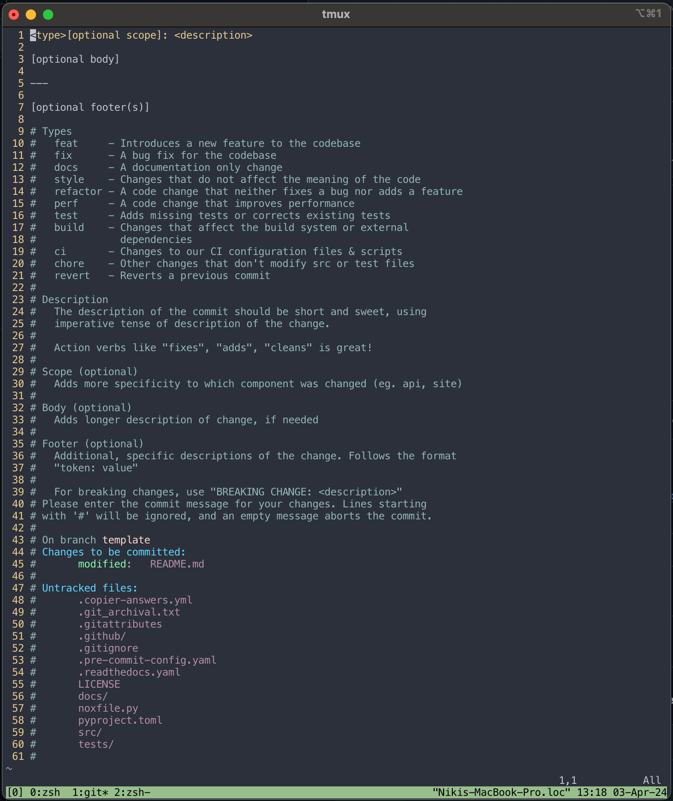

# Commit messages convention

During code development it is important to follow the [conventional commit v1.0](https://www.conventionalcommits.org/en/v1.0.0/)
convention for the structure of commit messages. This ensures both human and machine readability.

The commit message should be structured as follows:

```text
<type>[optional scope]: <description>

[optional body]

[optional footer(s)]
```

At the very least, the `type` and `description` of the commit are **required**.

## Pre-commit

To ensure that you're following the guidelines above,
you can use the [conventional-pre-commit](https://github.com/compilerla/conventional-pre-commit/) hook.

```yaml
- repo: https://github.com/compilerla/conventional-pre-commit
    rev: <git sha or tag>
    hooks:
      - id: conventional-pre-commit
        stages: [commit-msg]
        args: [] # optional: list of Conventional Commits types to allow e.g. [feat, fix, ci, chore, test]
```

## Set a default git commit message with these guidelines

If you want reminders of these guidelines every time you commit, you set [this git message](../resources/gitmessage) as the default you see when you run `git commit` by running the following commands

```sh
curl https://raw.githubusercontent.com/uw-ssec/rse-guidelines/main/resources/gitmessage > ~/.gitmessage
git config --global commit.template ~/.gitmessage
```


<details>
  <summary>
    See what this will look like when you run git commit
  </summary>

  

</details>

## Types

The following types of commits are acceptable:

type|title| explanation
----|-----|------------
`feat`|✨ Features | Introduces a new feature to the codebase
`fix`|🐛 Bug Fixes | A bug fix patch for the codebase
`docs`|📚 Documentation | A documentation only changes
`style`|💎 Styles | Changes that do not affect the meaning of the code (white-space, formatting, missing semi-colons, etc)
`refactor` | 📦 Code Refactoring | A code change that neither fixes a bug nor adds a feature
`perf` | 🚀 Performance Improvements | A code change that improves performance
`test` | 🚨 Tests | Adding missing tests or correcting existing tests
`build` | 🛠 Builds | Changes that affect the build system or external dependencies (example scopes: hatch, setuptool)
`ci` | ⚙️ Continuous Integrations | Changes to our CI configuration files and scripts (example scopes: Travis, Circle, Github Actions)
`chore` | ♻️ Chores | Other changes that don't modify src or test files
`revert` | 🗑 Reverts | Reverts a previous commit

## Description

The description of the commit should be short and sweet,
using imperative tense of description of the change.

Action verbs like "fixes", "adds", "cleans" is great! See examples below.

## Scope (*optional*)

Scope adds a little more specificity to what this change relate to such as
a component, module, or file name.

## Body (*optional*)

If you'd like to add a longer description of the change,
you can provide it here. This allows for an extensive documentation of
the reasons why the change happened.

## Footer (*optional*)

This allows for additional, specific description of the change.
When there's a breaking change, it's best practice to add the `BREAKING CHANGE`
footer followed by a description. Other footers can be some issue references,
or reviewers. Footers should follow the [git trailer format](https://git-scm.com/docs/git-interpret-trailers),
which is essentially: `token: value`.

It's also best practice to separate footer from the rest of the description body by adding at least 3 `-` dashes.
This signifies a divider between the sections.

For example:

```text
my description here

---

footer: some stuff
```

## Examples

The following examples are retrieved directly from the conventional commit [docs](https://www.conventionalcommits.org/en/v1.0.0/#examples).

### Commit message with description and breaking change footer

```text
feat: allow provided config object to extend other configs

---------

BREAKING CHANGE: `extends` key in config file is now used for extending other config files
```

### Commit message with `!` to draw attention to breaking change

```text
feat!: send an email to the customer when a product is shipped
```

### Commit message with scope and `!` to draw attention to breaking change

```text
feat(api)!: send an email to the customer when a product is shipped
```

### Commit message with both `!` and BREAKING CHANGE footer

```text
chore!: drop support for Node 6

---------

BREAKING CHANGE: use JavaScript features not available in Node 6.
```

### Commit message with no body

```text
docs: correct spelling of CHANGELOG
```

### Commit message with scope

```text
feat(lang): add Polish language
```

### Commit message with multi-paragraph body and multiple footers

```text
fix: prevent racing of requests

Introduce a request id and a reference to latest request. Dismiss
incoming responses other than from latest request.

Remove timeouts which were used to mitigate the racing issue but are
obsolete now.

---------

Reviewed-by: Z
Refs: #123
```
