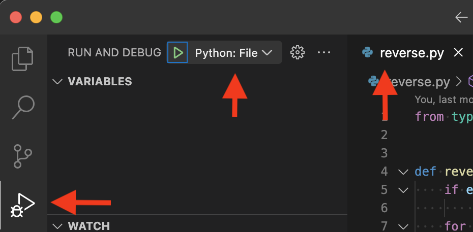
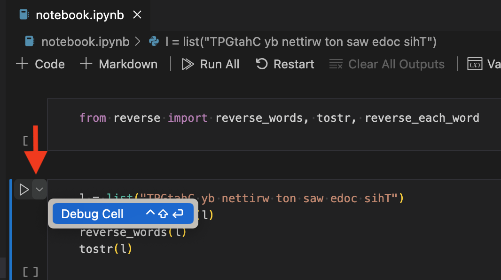
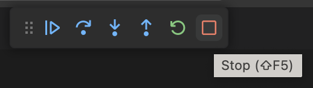
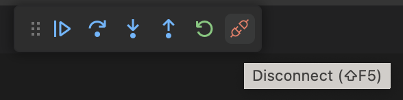

# Debugging with VS Code

A debugger is an incredibly powerful tool for developing software. It gives you visibility into the flow and state of your program as it is executing. It's also a great way of getting familiar with new code and building a mental model around it. 

VS Code provides a set of debugging tools that can be used across a wide range of languages. In these tutorials we'll be using python.

Pre-requisites:

- Get familiar with the basics on debugging with VS Code using these resources:
    - <https://code.visualstudio.com/docs/editor/debugging>
    - <https://code.visualstudio.com/docs/introvideos/debugging>
- Install the VS Code [Python extension](https://marketplace.visualstudio.com/items?itemName=ms-python.python). It pulls in the [Python Debugger extension](https://marketplace.visualstudio.com/items?itemName=ms-python.debugpy) automatically, which is what actually does the debugging.
- Get the exercise materials. They live in this repository under [`exercises/vscode-debugging/`](https://github.com/uw-ssec/rse-guidelines/tree/main/exercises/vscode-debugging):

```bash
git clone https://github.com/uw-ssec/rse-guidelines.git
cd rse-guidelines/exercises/vscode-debugging
pixi install
```

!!! warning "Open the exercise folder, not the repository root"

    `Python: GenDate` resolves `gendate.py` against `${workspaceFolder}`, and the
    `delete_today` task runs with that same folder as its working directory. Open
    `rse-guidelines/` instead of `exercises/vscode-debugging/` and the launch
    fails outright on the missing program, by which point `delete_today` will
    already have quietly cleared a `today.json` in the repo root that was never
    there, leaving the real one alone.

    ```bash
    code exercises/vscode-debugging
    ```

    Then pick your interpreter: Command Palette (`Cmd+Shift+P` / `Ctrl+Shift+P`)
    → **Python: Select Interpreter**.

## Basic debugging

- Open the `exercises/vscode-debugging` directory using VS Code
- Open `reverse.py` and review the code to get a basic understanding of what it does. Set up some break-points in the code, e.g. in line 17: `if s[i] == " ":`.
- Select the debugging tab on the left and the "Python: Current File" debugging configuration from the drop down at the top.
- Press F5 (or click on the green "play" button) to start debugging
- Step through the code a few times to get comfortable with the basics, such as:
    - Breakpoints: normal, log points, conditional
    - Data inspection: variables, watch and callstack tabs.



I highly recommend getting used to stepping through the code via function keys: `F5` (start/go), `F10` (step over) and `F11` (step into).

## Advanced debugging

### Unit testing

A very useful feature is being able to debug a unit test. This is easily done in VS Code by creating a launch configuration in `launch.json` to start the `pytest` module. An example one called `PyTest` is provided in the exercise materials. Try it out by selecting it from the RUN AND DEBUG drop down and hitting F5.

You'll note that this configuration specifies `tests.py` as the argument, but you can also specify a directory or any other argument that you can pass to `pytest`. For example, you can enable CLI logging and run a specific test by using the following arguments:

```
    "args": [
        "tests.py",
        "--log-cli-level=INFO",
        "-k", "test_reverse_words"
    ],
```
The logging statements will appear in the `Terminal` window with nice coloring.

### Jupyter notebooks

A small but very valuable feature is being able to debug into Jupyter notebooks when you run them in VS Code:

- Open `notebook.ipynb`
- Make sure you have a breakpoint in `reverse.py`
- Run the first cell 
- Start debugging the second cell by using the drop down on the left side:



You'll notice the debugger will attach and your breakpoint in `reverse.py` should get hit. You can even set breakpoints in the cell code itself. 

One thing to be aware of is that when you stop debugging the notebook, the kernel will keep running. Unlike debugging a unit test or a file, where stopping the debugger stops the process. Notice the difference in the stop buttons:




This can be very confusing if you change some code and start debugging again (assuming you are not using `%autoreload`)

### Pre-launch tasks

Some bugs only show up on the first run. `gendate.py` is a small example: it writes a `today.json` timestamp file, but only if that file doesn't already exist.

```python title="gendate.py"
def gendate():
    path = Path(FILE)
    if path.exists():
        print("file exists")
        return
    ...
```

Put a breakpoint below that guard and you will hit it exactly once, on the first run. Every run after that takes the early return and the interesting code never executes. Debugging it means deleting `today.json` by hand before every single launch.

A **pre-launch task** does that chore for you. Tasks are defined in `.vscode/tasks.json`, and a launch configuration can name one via `preLaunchTask`. VS Code runs the task to completion first, then starts the debugger:

```json title=".vscode/tasks.json"
{
    "label": "delete_today",
    "type": "shell",
    "command": "${command:python.interpreterPath}",
    "args": [
        "-c",
        "import pathlib; pathlib.Path('today.json').unlink(missing_ok=True)"
    ],
    "options": { "cwd": "${workspaceFolder}" },
    "problemMatcher": []
}
```

```json title=".vscode/launch.json"
{
    "name": "Python: GenDate",
    "type": "debugpy",
    "request": "launch",
    "program": "${workspaceFolder}/gendate.py",
    "console": "integratedTerminal",
    "justMyCode": false,
    "preLaunchTask": "delete_today"
}
```

The `label` in `tasks.json` and the `preLaunchTask` in `launch.json` have to match exactly. That string is the only thing connecting the two files, so a typo in either one gets you `Could not find the task 'delete_today'` and no hint about which of the two files you fat-fingered. I'd keep both open side by side while editing either one.

Try it: set a breakpoint on the `now = datetime.now(tz=None)` line in `gendate.py`, select **Python: GenDate**, and hit F5 several times in a row. It stops every time, because the task cleared the file before each launch.

!!! tip "Why `unlink(missing_ok=True)` and not `rm -f`"

    When these materials lived in the old `uw-ssec/vscode_debugging` repository
    this task was `"command": "rm -f ${workspaceFolder}/today.json"`. That is
    fine on macOS and Linux and errors on a Windows shell, where `cmd.exe` has no
    `rm` at all and PowerShell's `rm` is an alias for `Remove-Item`, which takes
    `-Force` and not `-f`. Either way the task exits non-zero, and a pre-launch
    task that exits non-zero blocks the debug session from starting, so the
    Windows failure was not a cosmetic one. Running Python instead works on all
    three, and `missing_ok=True` keeps it a no-op when the file isn't there.

    `${command:python.interpreterPath}` resolves to whichever interpreter you
    picked with **Python: Select Interpreter**, so the task follows your
    environment rather than a hard-coded path.

### Remote debugging

Everything so far starts the process from the debugger. Sometimes you can't: a service that has been up for three days, or a container entrypoint you didn't write. The debugger can attach to a process that is already running instead.

The exercise for this is `deleter.py`, a loop that watches for `today.json` and deletes it whenever it appears:

```python title="deleter.py"
if __name__ == "__main__":
    import debugpy

    debugpy.listen(5678)
    main()
```

`debugpy.listen(5678)` opens a debug server on port 5678 inside the running process. Execution doesn't stop there. The loop starts immediately and the port sits there waiting for a debugger to connect.

Start it from a terminal:

```bash
pixi run deleter        # or: python deleter.py
```

```text
PID: 33860
....
```

Now attach: select **Python: Attach using Port** from the RUN AND DEBUG drop down and press F5. The configuration points at the port that `deleter.py` opened:

```json title=".vscode/launch.json"
{
    "name": "Python: Attach using Port",
    "type": "debugpy",
    "request": "attach",
    "connect": { "host": "127.0.0.1", "port": 5678 },
    "justMyCode": true
}
```

Set a breakpoint on `file.unlink()` in `deleter.py`. Nothing happens yet, because the loop is idle with no file to delete. In a *second* terminal, create one:

```bash
pixi run gendate        # or: python gendate.py
```

Within a second the breakpoint fires, and you are stopped inside a process you never launched from VS Code.

Every configuration earlier on this page uses `"request": "launch"`, meaning VS Code starts the process. This one uses `"request": "attach"`: the process is already running and VS Code connects to it, and detaching leaves it running, which is the same idea as the notebook stop-versus-disconnect buttons further up.

The catch with `listen()` is that it doesn't wait for anyone. It opens the port and execution carries straight on, so if the bug you're chasing happens during startup the process will be well past it by the time you've clicked attach, and you'll sit there watching a breakpoint that never fires wondering what you did wrong. `debugpy.wait_for_client()` immediately after `listen()` blocks until the debugger connects, which is what you want in that case.

Don't leave the listener in code you ship. An open debug port lets anyone who can reach it execute arbitrary code inside your process. I'd gate it behind an environment variable or a `--debug` flag.

!!! warning "Debugging a process in a container or on another machine"

    `127.0.0.1` only works when the process is on your machine. For a container
    or remote host you need `debugpy.listen(("0.0.0.0", 5678))` in the process,
    the port published (`docker run -p 5678:5678 ...`), and a `pathMappings`
    entry in the configuration so VS Code can map the remote source paths back
    to your local checkout. See
    [Debugging by attaching over a network](https://code.visualstudio.com/docs/python/debugging#_debugging-by-attaching-over-a-network-connection)
    for the full setup.

You may see this on stderr when `deleter.py` starts:

```text
Debugger warning: It seems that frozen modules are being used, which may
make the debugger miss breakpoints.
```

It's noise from CPython's frozen startup modules, not a problem with your code. Set `PYDEVD_DISABLE_FILE_VALIDATION=1` to silence it.
