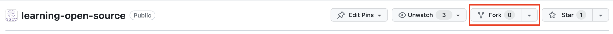
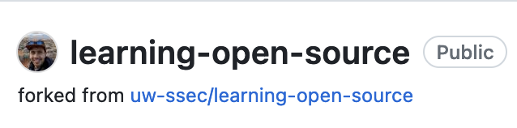
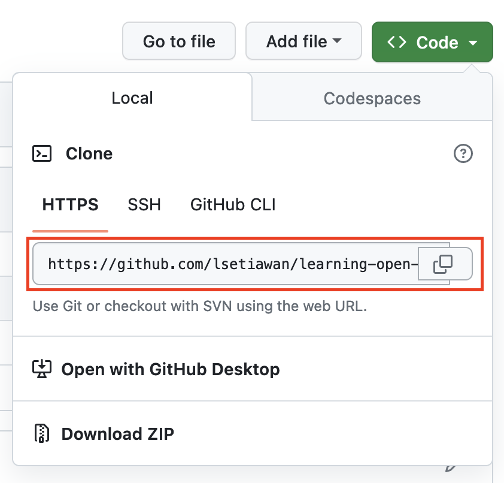
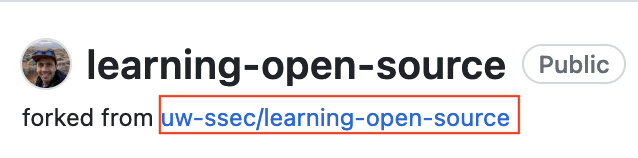

# Git and Github for collaboration

Collaboration is the lifeblood of modern software development. Whether you're building a web application, contributing to an open-source project, or working on a team project, efficient collaboration is key to success. You've seen in the previous tutorial that using Conda and Jupyter Notebook would allow for an efficient exchange of ideas and reproducibility.

In this tutorial, we'll explore the dynamic duo of Git and GitHub, two powerful tools that have revolutionized the way developers collaborate, manage code, and track changes. We'll delve into what Git and GitHub are, how they work, and how they can simplify and streamline collaborative coding.

## Git: The Foundation of Collaborative Coding

Git is a distributed version control system that was created by Linus Torvalds, the same genius behind Linux. It's designed to help developers manage and track changes to their code or documents, collaborate with others, and work seamlessly across different machines.

**Key features**:

- **Version Control**: Git allows you to track changes to your code over time, helping you understand what has been done, when it was done, and who did it.
- **Branching**: With Git, you can create branches to work on new features or bug fixes independently, keeping your main codebase clean and stable.
- **Merging**: Merging code from multiple branches is straightforward in Git, enabling smooth collaboration between team members.
- **Local and Remote Repositories**: Git supports local repositories for offline work and remote repositories for collaboration. This makes it versatile and accessible for developers in various scenarios.

There are a lot of resources out there to learn about how to use git, we recommend going through [Software Carpentry, Version Control with Git](https://swcarpentry.github.io/git-novice/).

## GitHub: The Collaborative Hub

[GitHub](https://github.com) is a web-based platform that hosts Git repositories, providing a central hub for collaboration and code management. It adds a layer of social interaction, project management, and collaboration tools on top of Git.

**Key features**:

- **Remote Hosting**: GitHub stores your Git repositories in the cloud, making them accessible from anywhere with an internet connection.

- **Pull Requests**: Developers can propose changes to a project through pull requests. This is a powerful way to review, discuss, and contribute to code improvements collaboratively.

- **Issue Tracking**: GitHub includes a built-in issue tracking system, allowing teams to manage tasks, bugs, and enhancements efficiently.

- **Documentation and Wikis**: You can create detailed documentation and wikis for your projects, making it easier for contributors to understand and work on your code.

- **Discussions**: You can host a forum based discussions within Github to track engagement for your project.

- **Codespaces**: A cloud-hosted development environments for software developers offered by Github. It allows developers to write, build, and test code directly within their web browser, making it easier to collaborate and work on projects from different devices and locations.

## Open Source Development with Git and GitHub

Git and GitHub work seamlessly together, creating an environment where developers can collaborate efficiently and manage code effectively. This allows ease of development and collaboration, which contributes to the success of many open source projects. Here's how:

- **Version Control with Git**: Git handles version control and local development, while GitHub serves as the remote hub for project sharing and collaboration.

- **Pull Requests**: GitHub's pull request feature allows developers to propose changes, review code, and have discussions, making it easy to manage contributions from multiple team members.

- **Forking and Cloning**: Developers can fork a project (create a personal copy) and clone it to their local environment, work on it, and propose changes back to the original project through pull requests.

- **Team Collaboration**: GitHub makes it easy for teams to work together, manage issues, and coordinate their work in a centralized location.

### Github Collaboration Step by step

Now that we've outlined the key features and values of Git and Github, let's walk through step by step on what this looks like with the previous knowledge of conda and jupyter notebook.

For your convenience we've set up a github repository where you can practice by contributing to it called [learning-open-source](https://github.com/uw-ssec/learning-open-source).

**NOTE: All code contribution should go into the `contributions` directory in that repository,
and underneath your own named directory.
For simplicity we suggest naming your directory the same way as your github username**

#### Step 1: Sign into GitHub

Sign into your GitHub account, or [create a free GitHub account](https://github.com/join) if you don't have one.

#### Step 2: Fork the project repository

Go to the `learning-open-source` repository at [https://github.com/uw-ssec/learning-open-source](https://github.com/uw-ssec/learning-open-source), and then "fork" it by clicking the Fork button in the upper right corner:



When prompted to Create a new fork, just press the **Green Create fork button**. This creates a copy of the project repository in your GitHub account. In the upper left corner, you will see that you are now looking at a repository in your account:



#### Step 3: Clone your fork

While still in your repository, click the green `<> Code` button and then copy the HTTPS URL in the Local tab:



Using Git on your local machine, clone your fork using the URL you just copied: `git clone URL_OF_FORK`.

For example, we used:

```console
git clone https://github.com/lsetiawan/learning-open-source.git
```

Cloning copies the repository files (and commit history) from GitHub to your local machine. The repository will be downloaded into a subdirectory of your working directory, and the subdirectory will have the same name as the repository.

#### Step 4: Navigate to your local repository

Since the clone was downloaded into a subdirectory of your working directory, you can navigate to it using:

```console
cd learning-open-source
```

#### Step 5: Check that your fork is the "origin" remote

You are going to be synchronizing your local repository with both the project repository (on GitHub) and your fork (also on GitHub).

The URLs that point to these repositories are called **"remotes"**.
More specifically, the project repository is called the `upstream` remote, and your fork is called the `origin` remote.

When you cloned your fork, that should have automatically set your fork as the `origin` remote.

You can get the current remotes:

```console
git remote -v
```

You should see the URL of your fork (which you copied in step 3) next to the word `origin`.

If you don't see an `origin` remote, you can add it using: `git remote add origin URL_OF_FORK`.

#### Step 6: Add the project repository as the "upstream" remote

Go to your fork on GitHub, and click the "forked from" link to return to the project repository:



While in the project repository, click the green `<> Code` button and then copy the HTTPS URL in the Local tab similar to step 3 above.

Add the project repository as the "upstream" remote using: `git remote add upstream URL_OF_PROJECT`.

For example, we used:

```console
git remote add upstream https://github.com/uw-ssec/learning-open-source.git
```

Use `git remote -v` again to check that you now have two remotes: an `origin` that points to your fork, and an `upstream` that points to the project repository.

```console
# Example below shows the terminal print out
% git remote -v
origin	https://github.com/lsetiawan/learning-open-source.git (fetch)
origin	https://github.com/lsetiawan/learning-open-source.git (push)
upstream	https://github.com/uw-ssec/learning-open-source.git (fetch)
upstream	https://github.com/uw-ssec/learning-open-source.git (push)
```
This diagram summarizes the entire setup process (steps 1 through 6):


#### Step 7: Pull the latest changes from upstream into your local repository

Before you start making any changes to your local files, it's a good practice to first synchronize your local repository with the project repository.
Use `git pull upstream main` to "pull" any changes from the `main` branch of the `upstream` into your local repository.

If you forked and cloned the project repository just a few minutes ago, it's very unlikely there will be any changes, in which case Git will report that your local repository is "already up to date".
But if there are any changes, they will automatically be merged into your local repository.

#### Step 8: Create a new branch

Rather than making changes to the project's `main` branch, it's a good practice to instead create your own branch. This creates an environment for your work that is isolated from the `main` branch.

Use `git checkout -b BRANCH_NAME` to create a new branch and then immediately switch to it.

*The name of the branch should briefly describe what you are working on, and should not contain any spaces.*

For example, we will create a new branch name called `add-notebook` to describe that we will be adding a jupyter notebook:

```console
git checkout -b add-notebook
```

Use `git branch` to show your local branches. You should see your new branch as well as "main", and your new branch should have an asterisk next to it to indicate that it's "checked out" (meaning that you're working in it).

```console
# Example below shows the terminal print out
% git branch
* add-notebook
  main
```

#### Step 9: Make changes in your local repository

Now we're ready to add the notebook and conda environment that we created earlier so we can share with everyone on github!
